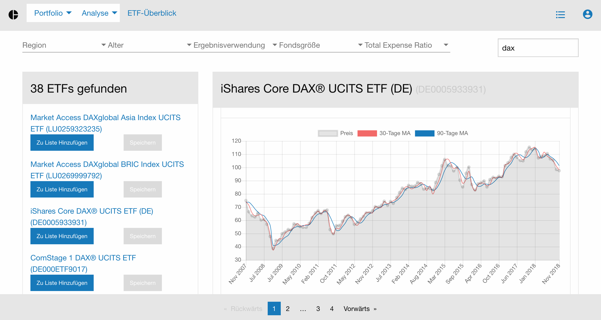
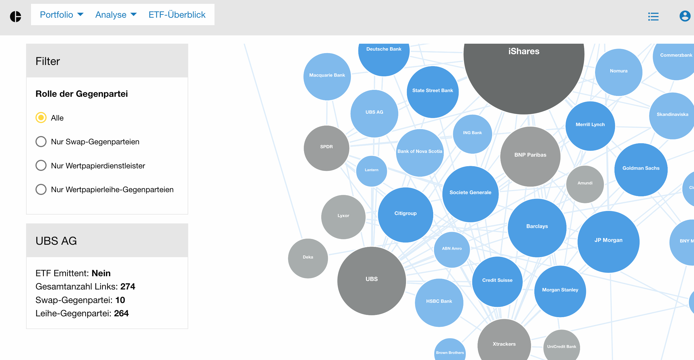
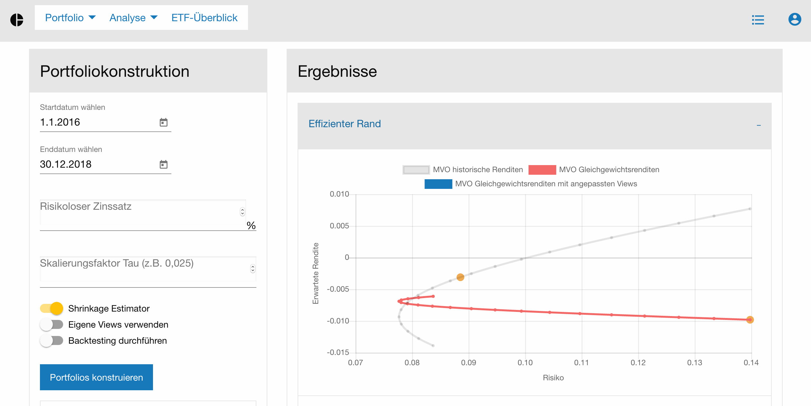
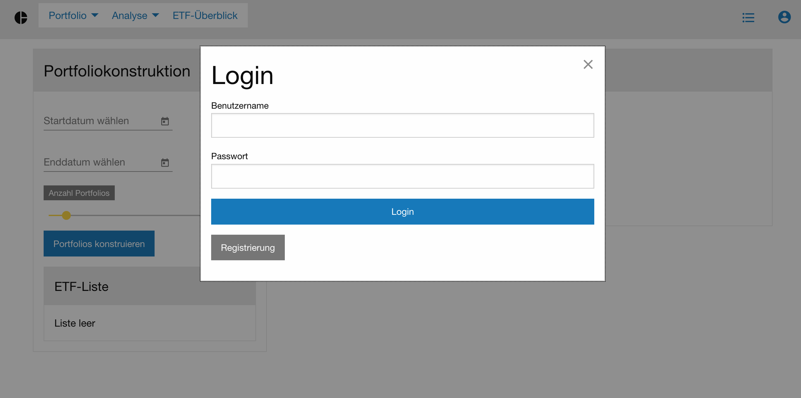

# EtfApp
An Angular application for ETF data analysis and efficient portfolio construction.
The app requires a running instance of the corresponding Api. 

  
   

  
  

## Development server

Run `ng serve` for a dev server. Navigate to `http://localhost:4200/`. The app will automatically reload if you change any of the source files.

## Code scaffolding

Run `ng generate component component-name` to generate a new component. You can also use `ng generate directive|pipe|service|class|guard|interface|enum|module`.

## Build

Run `ng build` to build the project. The build artifacts will be stored in the `dist/` directory. Use the `-prod` flag for a production build.

## Useful Resources
These are some resources that helped building the application.
### Component Sharing
- https://angularfirebase.com/lessons/sharing-data-between-angular-components-four-methods/#Unrelated-Components-Sharing-Data-with-a-Service
### Loadguard / Lazy loading
- https://devblog.dymel.pl/2017/04/10/angular-wait-for-resource-to-load/
- https://www.concretepage.com/angular/angular-canload-guard-example
- https://angular-2-training-book.rangle.io/handout/modules/lazy-loading-module.html
### Observables
- https://coryrylan.com/blog/angular-observable-data-services
- https://medium.com/@luukgruijs/understanding-creating-and-subscribing-to-observables-in-angular-426dbf0b04a3
- https://medium.com/@tkssharma/shopping-cart-app-using-angular-5-observables-subject-subscription-part-2-a007a610491a
### Ag-Grid and d3
- https://medium.com/ag-grid/data-visualisation-for-enterprise-with-angular-and-d3-54165a2778a6
- https://github.com/lsharir/angular-d3-graph-example/tree/master/src
- https://medium.com/netscape/visualizing-data-with-angular-and-d3-209dde784aeb
- https://github.com/lsharir/angular-d3-graph-example/tree/master/src/app/d3

### D3
- https://github.com/lsharir/angular-d3-graph-example
- https://medium.com/netscape/visualizing-data-with-angular-and-d3-209dde784aeb

### Data/Variable Sharing
- https://angularfirebase.com/lessons/sharing-data-between-angular-components-four-methods/

### Login/Registration
- http://jasonwatmore.com/post/2018/05/16/angular-6-user-registration-and-login-example-tutorial
- https://github.com/cornflourblue/angular-6-registration-login-example-cli

### Host Binding
- https://dzone.com/articles/what-are-hostbinding-and-hostlistener-in-angular
